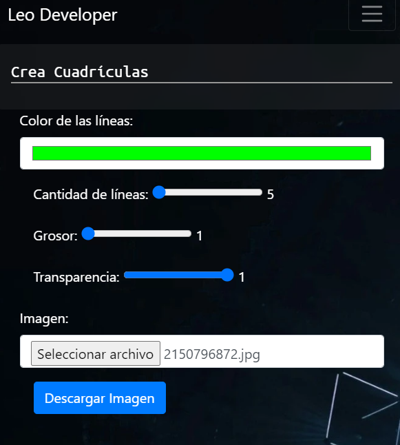
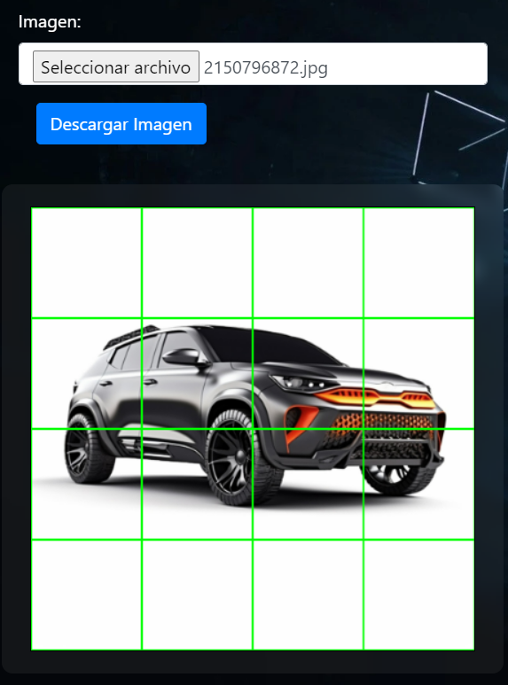

# Cuadricular
## Esta es una app en js que permite poner una cuadrícula a cualquier imagen para ayudar a dibujantes que usan esta técnica de referencia. Ésta, cuanta con diferentes valores de seting con el fin de ser manejable para todos los tamaños de imagenes y permite descargar el resultado.

Puedes probarla en mi Portafolio:[ir](https://leogidev.free.nf/Practicas/cuadricular/)
